<div align="center">
	<br>
	<a href="https://github.com/Yarob50/First-Contribution-ARABIC">
		
	</a>
	<br>
</div>

# طريقة المساهمة

حتى تبدأ بالمساهمة قم باتباع الخطوات التالية:

## ١- قم بعمل Fork

قم بالضغط على زر fork لعمل نسخة مستقلة من المستودع بحيث تكون خاصة بك و تابعة لحسابك

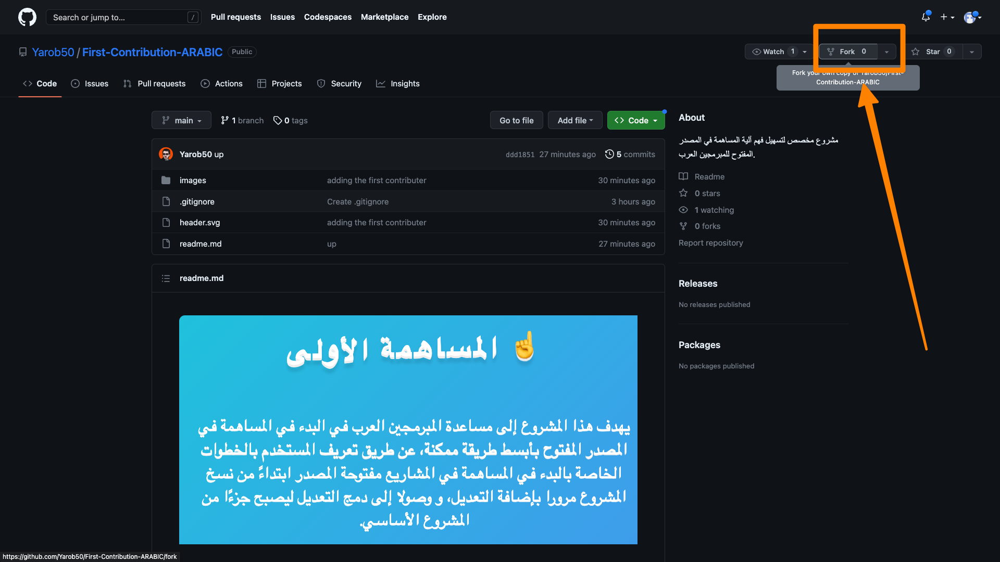

<br>

## ٢- قم بتأكيد البيانات و الضغط على fork

لا تحتاج إلى تغيير أي من البيانات الظاهرة و يمكنك الضغط على fork مباشرة

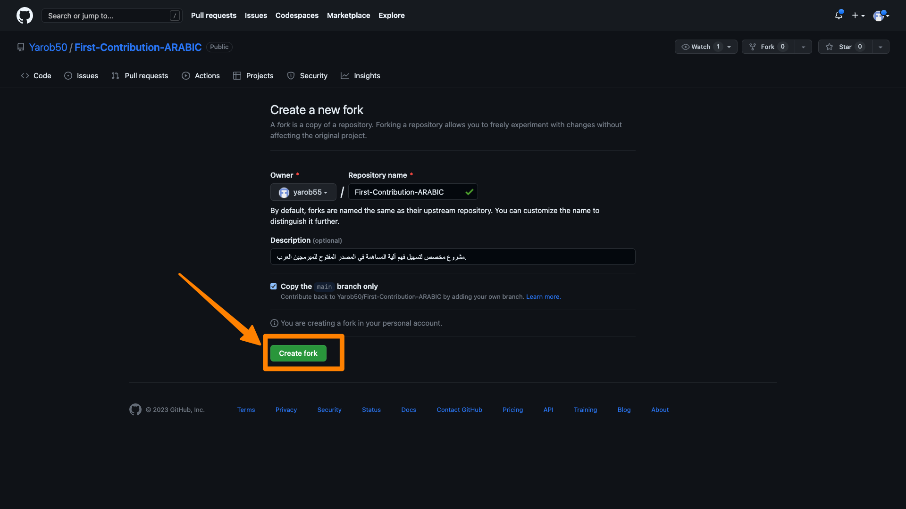

<br>

## ٣- سيتم إنشاء نسخة جديدة من المشروع

لاحظ ظهور اسمك و من ثم اسم المستودع مما يعني أنك حصلت على نسخة مستقلة من المشروع أصبحت تابعة لحسابك الشخصي.

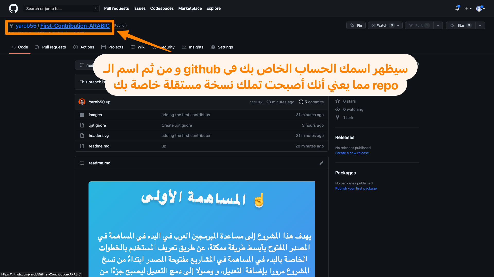

<br>

## ٤- قم بتنزيل المشروع

يتم التنزيل من خلال الضغط على زر `code` و من ثم اختيار أحد خيارات التحميل مثل: `download zip`.

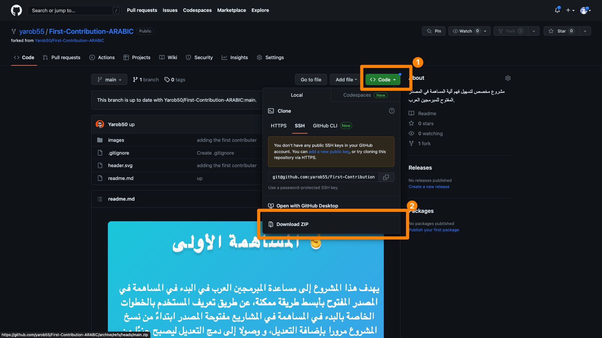

<br>

## ٥- افتح المشروع في في محرر الأكواد

يمكنك اختيار محرر الأكواد المناسب لك، قم بفتح المشروع من خلاله و من ثم توجه إلى ملف ال `readme.md`.

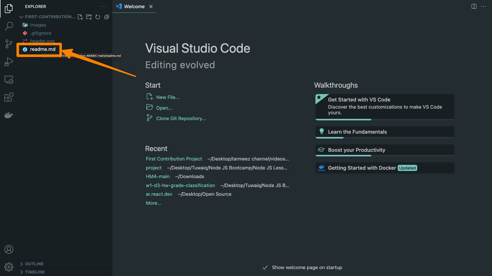

<br>

## ٦- حدد الجزء المطلوب و قم بنسخه

ستجد المكان الذي يحددلك مكان النسخ حيث يجب عليك النسخ من بداية ال `<tr>` و صولا إلى نهايته `</tr>`

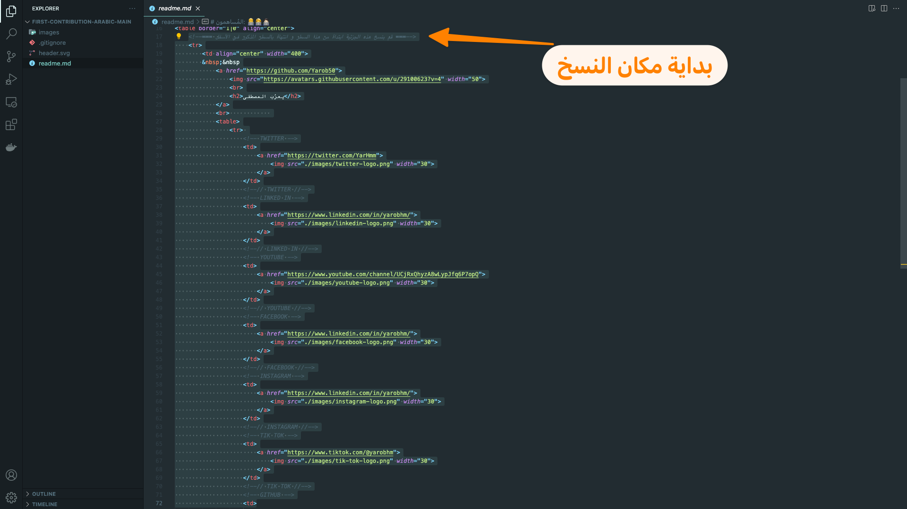
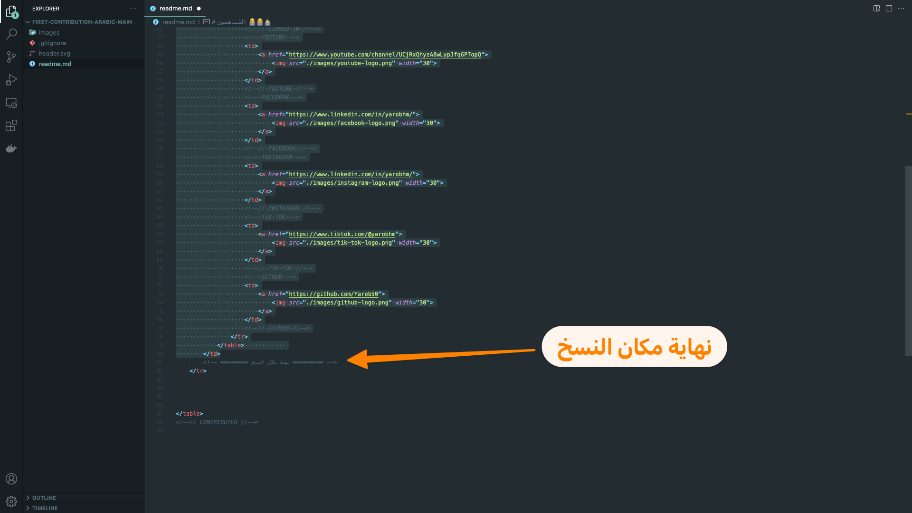

<br>

## ٧- قم باللصق و تحديث البيانات

تأكد من تحديث البيانات بعد اللصق و قم بحدف بيانات حساباتك في المنصات التي لا تريد لها أن تظهر.

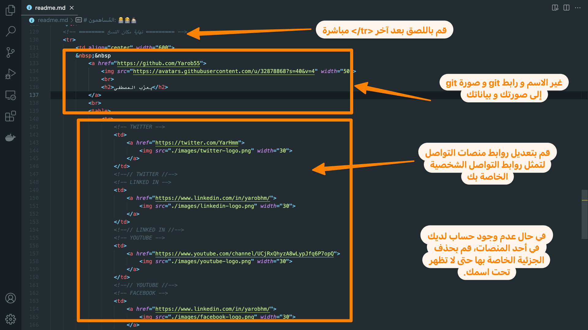

<br>

## ٨- قم بعمل `git init` في حال لم تقم بالتنزيل باستخدام `git clone...`.

ستحتاج هذا الأمر في حال اتبعت طريقة التنزيل اليدوية المذكورة في هذا الشرح عن طريق (donwload zip file).

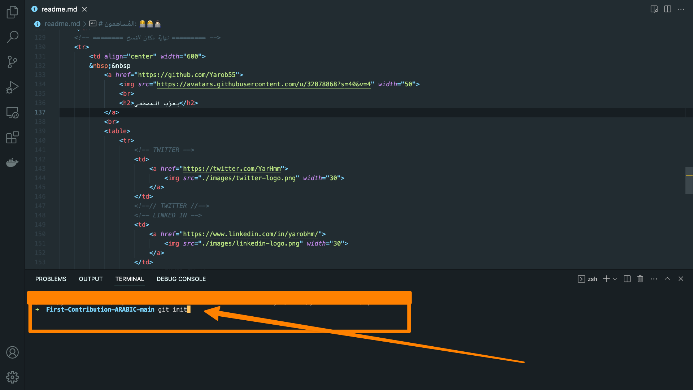

<br>

## ٩- قم بعمل `git add .` و من ثم `git commit` لحفظ التغييرات.

هذا سيقوم بحفظ التغييرات لديك محليا في الجهاز استعدادا لرفعها للمستودع (الخاص بك)

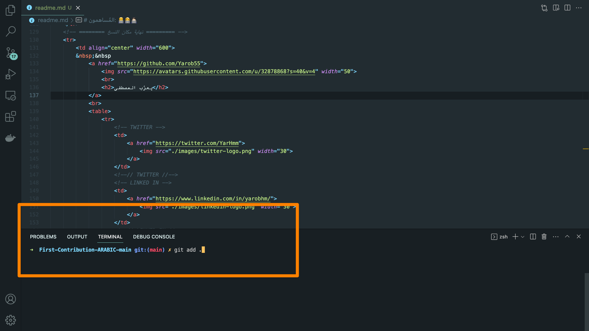

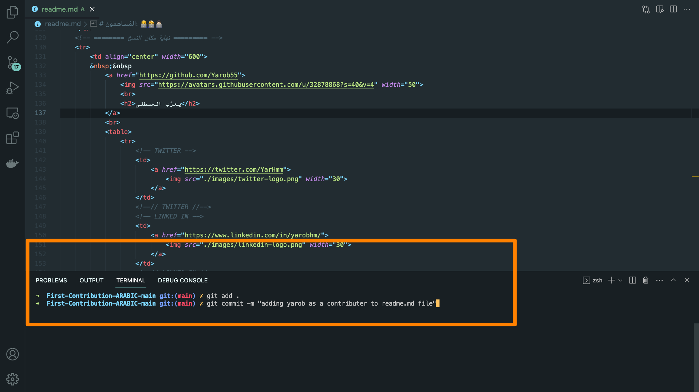

<br>

## ١٠ - في حال تنزيلك للمستودع بالطريقة اليدوية عليك أن تقوم بإضافة ال remote

لن يعمل معك أمر `git push origin main` مباشرة في حال التنزيل اليدوي و إنما عليك أن تقوم بإضافة ال `remote` أولا،
و المقصود بذلك أن تحدد المستودع من github الذي يمثل المكان الذي سيتم رفع الكود إليه في حال تم عمل `git push origin main`.
و ذلك من خلال نسخ الرابط من زر `code` من نسخة المستودع الخاصة بك و من ثم استخدامه في الأمر التالي:

```
    git remote add origin <your rep url here>
```

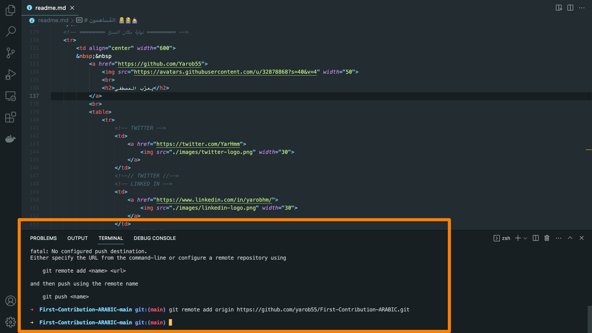

<br>

## ١١- قم برفع التغييرات إلى مستودعك

قم برفع التغييرات باستخدام الأمر: `git push origin main`.
هذا سيقوم برفع التغييرات إلى نسختك من المستودع و ليس إلى النسخة الأصلية التي قمت بعمل ال Fork منها.

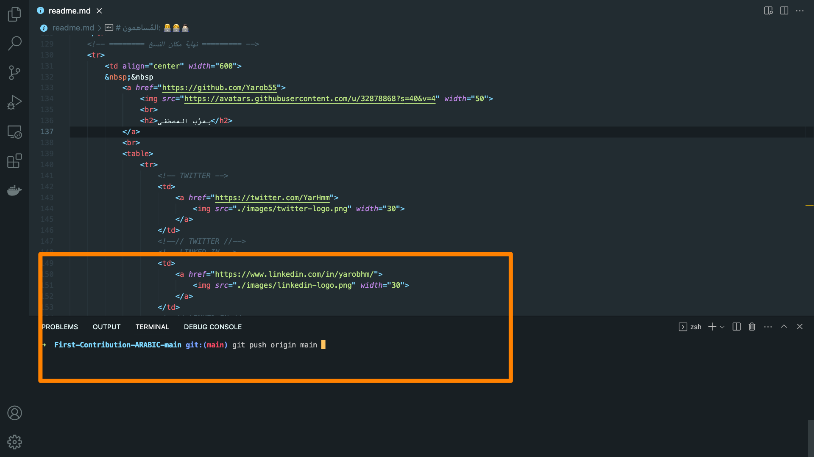

<br>

## ١٢- قم بفتح نسخة المستودع الخاصة بك

تأكد أنك فتحت نسخة المستودع الخاصة بحسابك في github و ليس النسخة الأصلية من المشروع، ستلاحظ أن التغيير الذي قمت بعمله قد تم إضافته

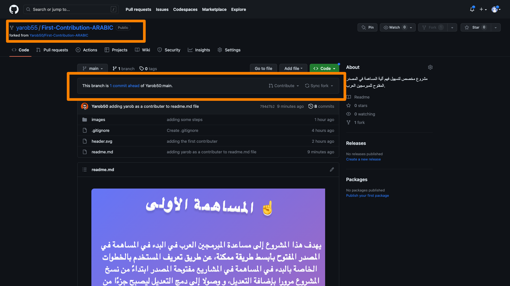
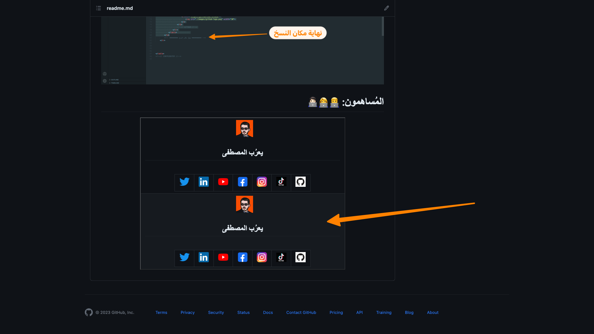

<br>

## ١٣- قم بعمل ال Pull Request

قم بعمل ال pull request كما هو موضح في الصورة و هي طريقة لطلب اعتماد التغيير الذي قمت به في النسخة الأصلية من المشروع.
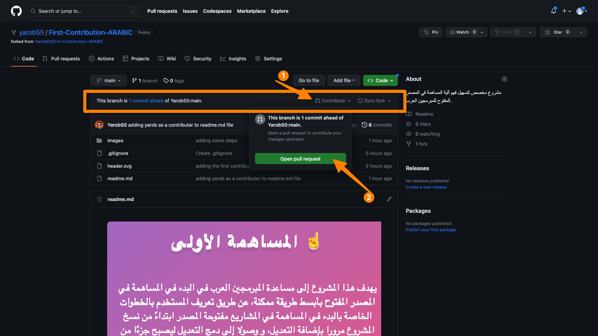

<br>

## ١٤- قم بإرسال ال Pull Request

قم بتعبئة البيانات كما هو موضح في الصورة و من ثم اعتمد إرسال ال pull request عن طريق الضغط على create pull request.
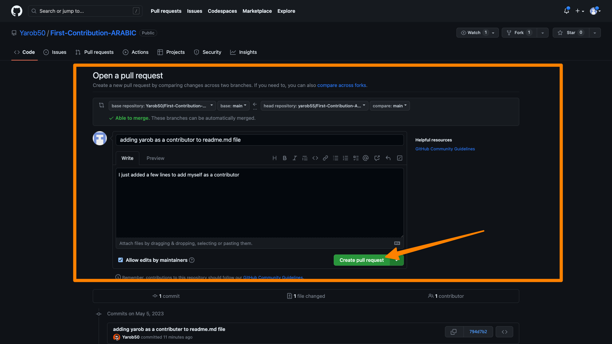

<br>

## ١٥- انتظر حتى يتم اعتماد طلبك

بعد ذلك سيصل طلبك إلي و في حال عدم وجود أية ملاحظات فسأقوم باعتماده ليصبح جزءًا من المشروع الأصلي و يتم إضافتك إلى قائمة المساهمين، حينها ستكون قد أتممت مساهمتك الأولى في المصدر المفتوح. 👌🏻😄


---

<br>
<br>

# المُساهمون: 👨‍💻👩‍💻🧑🏻‍💻

<!-- CONTRIBUTER -->
<table border="1|0" align="center">
    <!--=== قم بنسخ هذه الجزئية ابتداءً من هذا السطر و انتهاءً بالسطر المذكور في الأسفل ===-->
    <tr>
        <td align="center" width="600">
        &nbsp;&nbsp
            <a href="https://github.com/Yarob50">
                
                <br>
                <h2>يعرُب المصطفى</h2>
            </a>
            <br>            
            <table>
                <tr> 
                    <!-- TWITTER -->
                    <td>
                        <a href="https://twitter.com/YarHmm">
                            
                        </a>
                    </td>
                    <!--// TWITTER //-->
                    <!-- LINKED IN -->
                    <td>
                        <a href="https://www.linkedin.com/in/yarobhm/">
                            
                        </a>
                    </td>
                    <!--// LINKED IN //-->
                    <!-- YOUTUBE -->
                    <td>
                        <a href="https://www.youtube.com/channel/UCjRxQhyzA8wLypJfq6P7opQ">
                            
                        </a>
                    </td>
                    <!--// YOUTUBE //-->
                    <!-- FACEBOOK -->
                    <td>
                        <a href="https://www.linkedin.com/in/yarobhm/">
                            
                        </a>
                    </td>
                    <!--// FACEBOOK //-->
                    <!-- INSTAGRAM -->
                    <td>
                        <a href="https://www.linkedin.com/in/yarobhm/">
                            
                        </a>
                    </td>
                    <!--// INSTAGRAM //-->
                    <!-- TIK TOK -->
                    <td>
                        <a href="https://www.tiktok.com/@yarobhm">
                            
                        </a>
                    </td>
                    <!--// TIK TOK //-->
                    <!-- GITHUB -->
                    <td>
                        <a href="https://github.com/Yarob50">
                            
                        </a>
                    </td>
                    <!--// GITHUB //-->
                </tr>
            </table>            
        </td>
    </tr>
    <!-- ======== نهاية مكان النسخ ========= -->
    <tr>
        <td align="center" width="600">
        &nbsp;&nbsp
            <a href="https://github.com/yarob55">
                
                <br>
                <h2>Yarob Al Mostafa</h2>
            </a>
            <br>            
            <table>
                <tr> 
                    <!-- TWITTER -->
                    <td>
                        <a href="https://twitter.com/YarHmm">
                            
                        </a>
                    </td>
                    <!--// TWITTER //-->
                    <!-- LINKED IN -->
                    <td>
                        <a href="https://www.linkedin.com/in/yarobhm/">
                            
                        </a>
                    </td>
                    <!--// LINKED IN //-->
                    <!-- YOUTUBE -->
                    <td>
                        <a href="https://www.youtube.com/channel/UCjRxQhyzA8wLypJfq6P7opQ">
                            
                        </a>
                    </td>
                    <!--// YOUTUBE //-->
                    <!-- TIK TOK -->
                    <td>
                        <a href="https://www.tiktok.com/@yarobhm">
                            
                        </a>
                    </td>
                    <!--// TIK TOK //-->
                    <!-- GITHUB -->
                    <td>
                        <a href="https://github.com/yarob55">
                            
                        </a>
                    </td>
                    <!--// GITHUB //-->
                </tr>
            </table>            
        </td>
    </tr>
     <tr>
        <td align="center" width="600">
        &nbsp;&nbsp
            <a href="https://github.com/dr-almukhtar">
                
                <br>
                <h2> Dr. Muhannad Almukhtar </h2>
            </a>
            <br>            
            <table>
                <tr> 
                    <!-- GITHUB -->
                    <td>
                        <a href="https://github.com/dr-almukhtar">
                            
                        </a>
                    </td>
                    <!--// GITHUB //-->
                </tr>
            </table>            
        </td>
    </tr>
    <tr>
        <td align="center" width="600">
        &nbsp;&nbsp
            <a href="https://github.com/SaifSaidi">
                
                <br>
                <h2>Saif Saidi</h2>
            </a>
            <br>            
            <table>
                <tr>
                    <!-- GITHUB -->
                    <td>
                        <a href="https://github.com/SaifSaidi">
                          
                        </a>
                    </td>
                    <!--// GITHUB //-->
                </tr>
            </table>            
        </td>
    </tr>
    <tr>
        <td align="center" width="600">
            &nbsp;&nbsp
            <a href="https://github.com/Mazin-Fouad">
                
                <br />
                <h2>مازن فؤاد</h2>
            </a>
            <br />
            <table>
                <tr>
                    <!-- LINKED IN -->
                    <td>
                    <a href="linkedin.com/in/mazin-fouad-332b36266">
                        
                    </a>
                    </td>
                    <!--// LINKED IN //-->
                    <!-- GITHUB -->
                    <td>
                    <a href="https://github.com/Mazin-Fouad">
                        
                    </a>
                    </td>
                    <!--// GITHUB //-->
                </tr>
            </table>
        </td>
    </tr>
    <tr>
        <td align="center" width="600">
        &nbsp;&nbsp
            <a href="https://github.com/Mohamed-avr">
                
                <br>
                <h2> mohamed boukhanouf </h2>
            </a>
            <br>            
            <table>
                <tr>
                    <!-- TWITTER -->
                    <td>
                        <a href="https://twitter.com/MohamedBoukhan5">
                            
                        </a>
                    </td>
                    <!--// TWITTER //-->
                    <!-- LINKED IN -->
                    <td>
                        <a href="https://www.linkedin.com/in/mohamed-boukhanouf-796583201/">
                            
                        </a>
                    </td>
                    <!--// LINKED IN //-->
                    <!-- FACEBOOK -->
                    <td>
                        <a href="">
                            
                        </a>
                    </td>
                    <!--// FACEBOOK //-->
                    <!-- GITHUB -->
                    <td>
                        <a href="https://github.com/Mohamed-avr">
                            
                        </a>
                    </td>
                    <!--// GITHUB //-->
                </tr>
            </table>
        </td>
    </tr>
    <tr>
        <td align="center" width="600">
        &nbsp;&nbsp
            <a href="https://github.com/youshakh">
                
                <br>
                <h2>yousha khadra</h2>
            </a>
            <br>            
            <table>
                <tr> 
                    <!-- FACEBOOK -->
                    <td>
                        <a href="https://www.facebook.com/yousha.khadra">
                            
                        </a>
                    </td>
                    <!--// FACEBOOK //-->
                    <!--// INSTAGRAM //-->
                    <!-- TIK TOK -->
                    <td>
                        <a href="https://www.tiktok.com/@yousha_khadra?is_from_webapp=1&sender_device=pc">
                            
                        </a>
                    </td>
                    <!--// TIK TOK //-->
                    <!-- GITHUB -->
                    <td>
                        <a href="https://github.com/youshakh">
                        
                        </a>
                    </td>
                    <!--// GITHUB //-->
                </tr>
            </table>
        </td>
        <tr>
        <td align="center" width="600">
        &nbsp;&nbsp
            <a href="https://github.com/NinaLoop">
                
                <br>
                <h2>NinaLoop</h2>
            </a>
            <br>            
            <table>
                <tr> 
                    <!-- TWITTER -->
                    <td>
                        <a href="https://twitter.com/ninaloop_">
                            
                        </a>
                    </td>
                    <!--// TWITTER //-->
                    <!-- GITHUB -->
                    <td>
                        <a href="https://github.com/NinaLoop">
                            
                        </a>
                    </td>
                    <!--// GITHUB //-->
                </tr>
            </table>            
        </td>
    </tr>
    <tr>
        <td align="center" width="600">
        &nbsp;&nbsp
            <a href="https://github.com/Marouane-Ch21">
                
                <br>
                <h2>Marouane Ch</h2>
            </a>
            <br>            
            <table>
                <tr> 
                    <!-- TWITTER -->
                    <td>
                        <a href="https://twitter.com/marouane_chf">
                            
                        </a>
                    </td>
                    <!--// TWITTER //-->
                    <!-- GITHUB -->
                    <td>
                        <a href="https://github.com/Marouane-Ch21">
                            
                        </a>
                    </td>
                    <!--// GITHUB //-->
                </tr>
            </table>            
        </td>
    </tr>
    <tr>
        <td align="center" width="600">
        &nbsp;&nbsp
            <a href="https://github.com/maryam800">
                
                <br>
                <h2>Maryam Ali</h2>
            </a>
            <br>            
            <table>
                <tr> 
                    <!-- TWITTER -->
                    <td>
                        <a href="https://twitter.com/MaryamA29096677">
                            
                        </a>
                    </td>
                    <!--// TWITTER //-->
                    <!-- LINKED IN -->
                    <td>
                        <a href="https://www.linkedin.com/in/maryam-ali-191a53130/">
                            
                        </a>
                    </td>
                    <!--// LINKED IN //-->
                    <!-- GITHUB -->
                    <td>
                        <a href="https://github.com/maryam800">
                            
                        </a>
                    </td>
                    <!--// GITHUB //-->
                </tr>
            </table>            
        </td>
    </tr>
    <tr>
        <td align="center" width="600">
        &nbsp;&nbsp
            <a href="https://github.com/kahkaj">
                
                <br>
                <h2>محمد محسن</h2>
            </a>
            <br>            
            <table>
                <tr> 
                    <!-- TWITTER -->
                    <td>
                        <a href="https://twitter.com/Mohcine17619305">
                            
                        </a>
                    </td>
                    <!--// TWITTER //-->
                    <!-- GITHUB -->
                    <td>
                        <a href="https://github.com/kahkaj">
                            
                        </a>
                    </td>
                    <!--// GITHUB //-->
                </tr>
            </table>            
        </td>
    </tr>
    <!-- AHMAD SINAN -->
    <tr>
        <td align="center" width="600">
        &nbsp;&nbsp
            <a href="https://github.com/Dev-AhmedOmer">
                
                <br>
                <h2>أحمد السناني</h2>
            </a>
            <br>            
            <table>
                <tr> 
                    <!-- TWITTER -->
                    <td>
                        <a href=
                            
                        </a>
                    </td>
                    <!--// TWITTER //-->
                    <!-- LINKED IN -->
                    <td>
                        <a href="https://www.linkedin.com/in/yarobhm/">
                            
                        </a>
                    </td>
                    <!--// LINKED IN //-->
                    <!-- YOUTUBE -->
                    <td>
                        <a href="https://www.youtube.com/channel/UCjRxQhyzA8wLypJfq6P7opQ">
                            
                        </a>
                    </td>
                    <!--// YOUTUBE //-->
                    <!-- FACEBOOK -->
                    <td>
                        <a href="https://www.facebook.com/a7mdOmr/">
                            
                        </a>
                    </td>
                    <!--// FACEBOOK //-->
                    <!-- INSTAGRAM -->
                    <td>
                        <!-- <a href="https://www.linkedin.com/in/yarobhm/">
                            
                        </a> -->
                    </td>
                    <!--// INSTAGRAM //-->
                    <!-- TIK TOK -->
                    <td>
                        <a href="https://www.tiktok.com/@yarobhm">
                            
                        </a>
                    </td>
                    <!--// TIK TOK //-->
                    <!-- GITHUB -->
                    <td>
                        <a href="https://github.com/Dev-AhmedOmer">
                            
                        </a>
                    </td>
                    <!--// GITHUB //-->
                </tr>
            </table>            
        </td>
    </tr>
    <!--// AHMAD SINAN //-->
    <!-- FAYYAD -->
    <tr>
        <td align="center" width="600">
        &nbsp;&nbsp
            <a href="https://github.com/mohamdFayyad">
                
                <br>
                <h2>Mohamed Fayyad</h2>
            </a>
            <br>            
            <table>
                <tr>
                    <!-- LINKED IN -->
                    <td>
                        <a href="https://www.linkedin.com/in/mohamed-fayyad-48298922a/">
                            
                        </a>
                    </td>
                    <!--// LINKED IN //-->
                    <!-- GITHUB -->
                    <td>
                        <a href="https://github.com/mohamdFayyad">
                            
                        </a>
                    </td>
                    <!--// GITHUB //-->
                </tr>
            </table>            
        </td>
    </tr>
    <!--// FAYYAD //-->
    <!-- MOHAMMED ALSAEADY -->
    <tr>
        <td align="center" width="600">
        &nbsp;&nbsp
            <a href="https://github.com/Mandela95">
                
                <br>
                <h2>Mohamed Elseady</h2>
            </a>
            <br>            
            <table>
                <tr> 
                    <!-- TWITTER -->
                    <td>
                        <a href="https://twitter.com/MohElseady">
                            
                        </a>
                    </td>
                    <!--// TWITTER //-->
                    <!-- LINKED IN -->
                    <td>
                        <a href="https://www.linkedin.com/in/mo-seady/">
                            
                        </a>
                    </td>
                    <!--// LINKED IN //-->
                    <!-- FACEBOOK -->
                    <td>
                        <a href="https://www.facebook.com/hamoelseady/">
                            
                        </a>
                    </td>
                    <!--// FACEBOOK //-->
                    <!-- INSTAGRAM -->
                    <td>
                        <a href="https://www.instagram.com/els3eedy/">
                            
                        </a>
                    </td>
                    <!--// INSTAGRAM //-->
                    <!-- GITHUB -->
                    <td>
                        <a href="https://github.com/Mandela95">
                            
                        </a>
                    </td>
                    <!--// GITHUB //-->
                </tr>
            </table>            
        </td>
    </tr>
    <!--// MOHAMMED ALSAEADY //-->
    <!-- MUHA -->
    <tr>
        <td align="center" width="600">
        &nbsp;&nbsp
            <a href="https://github.com/nmcev">
                
                <br>
                <h2>muha</h2>
            </a>
            <br>            
            <table>
                <tr> 
                    <!-- LINKED IN -->
                    <td>
                        <a href="https://www.linkedin.com/in/muhammed-khalid-2058b5251/">
                            
                        </a>
                    </td>
                    <!--// LINKED IN //-->
                    <!-- GITHUB -->
                    <td>
                        <a href="https://github.com/nmcev">
                            
                        </a>
                    </td>
                    <!--// GITHUB //-->
                </tr>
            </table>            
        </td>
    </tr>
    <!-- MUHA -->
    <tr>
        <td align="center" width="600">
        &nbsp;&nbsp
            <a href="https://github.com/amirgendy">
                
                <br>
                <h2>Amir Gendy Botros</h2>
            </a>
            <br>            
            <table>
                <tr> 
                    <!-- TWITTER -->
                    <td>
                        <a href="https://twitter.com/amir_gendy">
                            
                        </a>
                    </td>
                    <!--// TWITTER //-->
                    <!-- LINKED IN -->
                    <td>
                        <a href="https://www.linkedin.com/in/amirgendybotros/">
                            
                        </a>
                    </td>
                    <!--// LINKED IN //-->
                    <!-- FACEBOOK -->
                    <td>
                        <a href="https://www.facebook.com/AmirGendyBotros/">
                            
                        </a>
                    </td>
                    <!--// FACEBOOK //-->
                    <!-- GITHUB -->
                    <td>
                        <a href="https://github.com/amirgendy">
                            
                        </a>
                    </td>
                    <!--// GITHUB //-->
                </tr>
            </table>            
        </td>
    </tr>
    <!-- Amir Gendy Botros -->
</table>
<!--// CONTRIBUTER //-->
